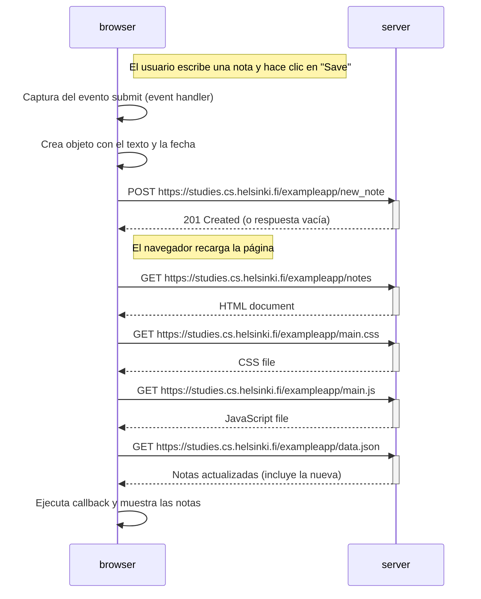

# Ejercicio 0.4 - Diagrama de creación de nota

```mermaid
sequenceDiagram
    participant browser
    participant server

    Note right of browser: El usuario escribe una nota y hace clic en "Save"

    browser->>browser: Captura del evento submit (event handler)
    browser->>browser: Crea objeto con el texto y la fecha
    browser->>server: POST https://studies.cs.helsinki.fi/exampleapp/new_note
    activate server
    server-->>browser: 201 Created (o respuesta vacía)
    deactivate server

    Note right of browser: El navegador recarga la página

    browser->>server: GET https://studies.cs.helsinki.fi/exampleapp/notes
    activate server
    server-->>browser: HTML document
    deactivate server

    browser->>server: GET https://studies.cs.helsinki.fi/exampleapp/main.css
    activate server
    server-->>browser: CSS file
    deactivate server

    browser->>server: GET https://studies.cs.helsinki.fi/exampleapp/main.js
    activate server
    server-->>browser: JavaScript file
    deactivate server

    browser->>server: GET https://studies.cs.helsinki.fi/exampleapp/data.json
    activate server
    server-->>browser: Notas actualizadas (incluye la nueva)
    deactivate server

    browser->>browser: Ejecuta callback y muestra las notas
```