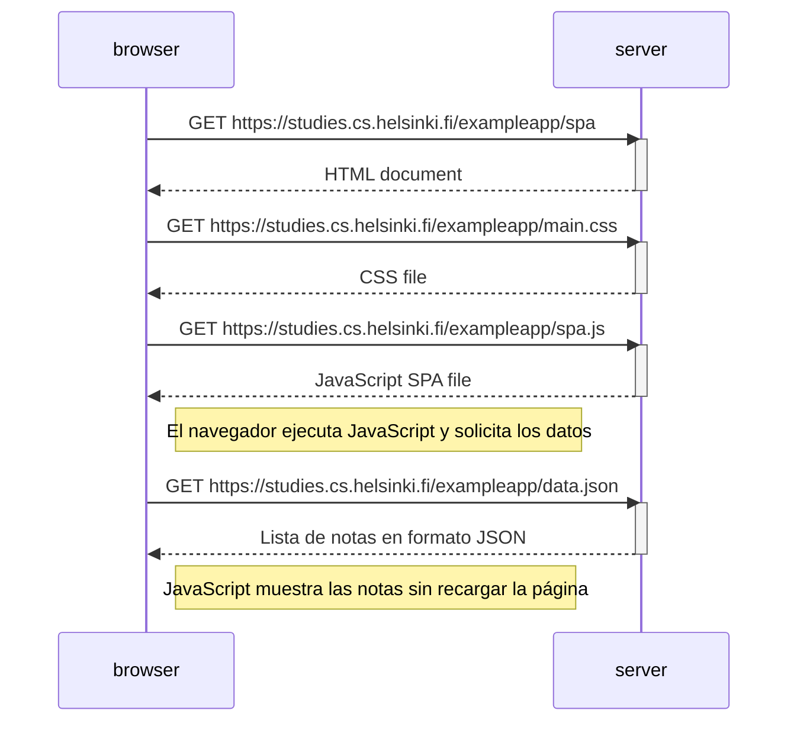

# Ejercicio 0.5 - SPA: Carga inicial de la app

```mermaid
sequenceDiagram
    participant browser
    participant server

    browser->>server: GET https://studies.cs.helsinki.fi/exampleapp/spa
    activate server
    server-->>browser: HTML document
    deactivate server

    browser->>server: GET https://studies.cs.helsinki.fi/exampleapp/main.css
    activate server
    server-->>browser: CSS file
    deactivate server

    browser->>server: GET https://studies.cs.helsinki.fi/exampleapp/spa.js
    activate server
    server-->>browser: JavaScript SPA file
    deactivate server

    Note right of browser: El navegador ejecuta JavaScript y solicita los datos

    browser->>server: GET https://studies.cs.helsinki.fi/exampleapp/data.json
    activate server
    server-->>browser: Lista de notas en formato JSON
    deactivate server

    Note right of browser: JavaScript muestra las notas sin recargar la página
```