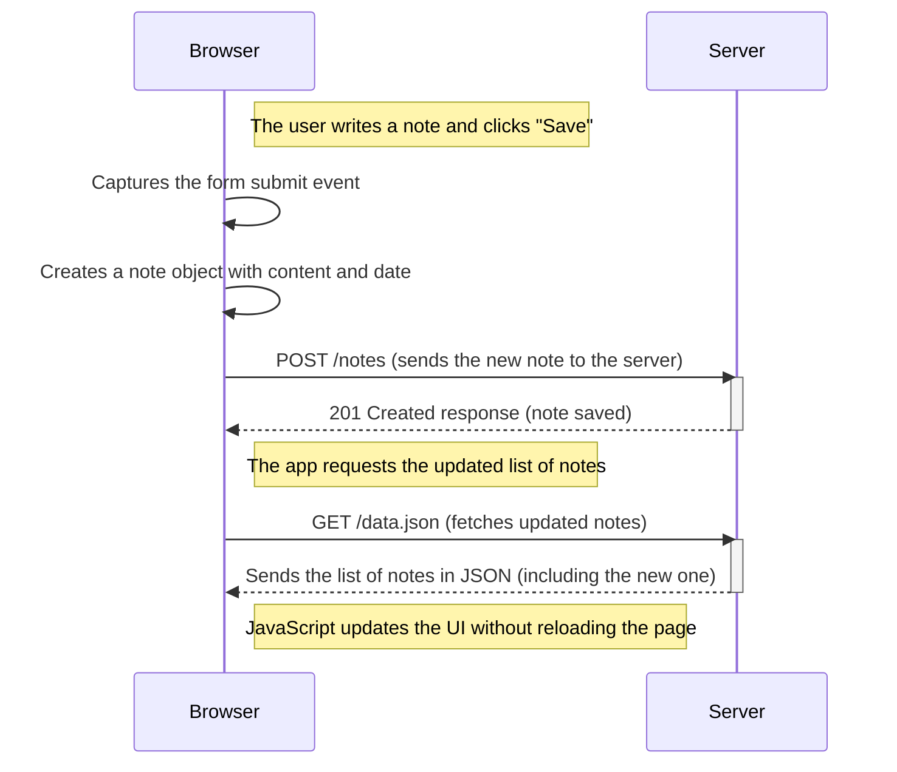

```mermaid
 sequenceDiagram
    participant Browser
    participant Server

    Note right of Browser: The user writes a note and clicks "Save"

    Browser->>Browser: Captures the form submit event
    Browser->>Browser: Creates a note object with content and date

    Browser->>Server: POST /notes (sends the new note to the server)
    activate Server
    Server-->>Browser: 201 Created response (note saved)
    deactivate Server

    Note right of Browser: The app requests the updated list of notes

    Browser->>Server: GET /data.json (fetches updated notes)
    activate Server
    Server-->>Browser: Sends the list of notes in JSON (including the new one)
    deactivate Server

    Note right of Browser: JavaScript updates the UI without reloading the page
```